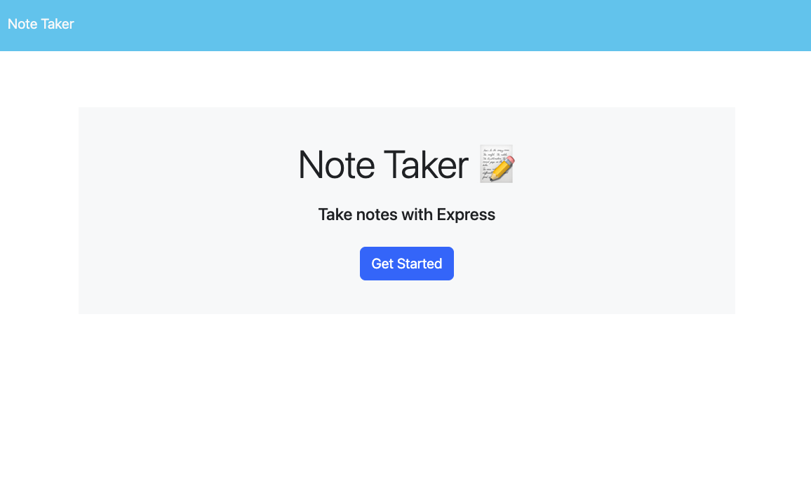
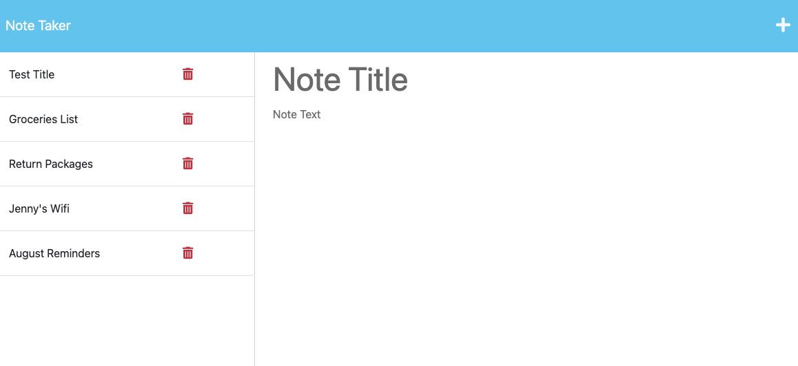
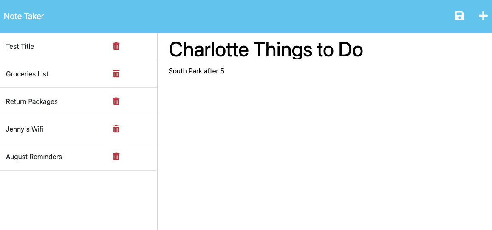

# Express Note Taker

## Application Links
* GitHub Repository for Application: 

* Heroku Deployed Application:


## Description
For this week's Challenge, I was tasked to build the back end of a note-taking application using `Express.js` so that it connects to the front end of a given starter code to save and retrieve note data from a JSON file.

## User Story

```
AS A small business owner
I WANT to be able to write and save notes
SO THAT I can organize my thoughts and keep track of tasks I need to complete
```


## Usage
The *Express Note Taker* serves as a tool for users to write and save notes all in one application. 

The following images demonstrate the appearance and functionality of the Express Note Taker web application:







---

## Technologies Used

* [VS Code](https://code.visualstudio.com/)
* [Node.js](https://nodejs.org/en)
* [Node Package Manager](https://www.npmjs.com/)
* [Inquirer Package](https://www.npmjs.com/package/inquirer)
* [uuid](https://www.npmjs.com/package/uuid)
* [Express](https://expressjs.com/)


## Questions?
If you have any questions, please see my contact information below to reach me for inquiries:
* **GitHub**: mackenzie-wentworth, at https://github.com/mackenzie-wentworth
* **Email**: mwentworth28@gmail.com
